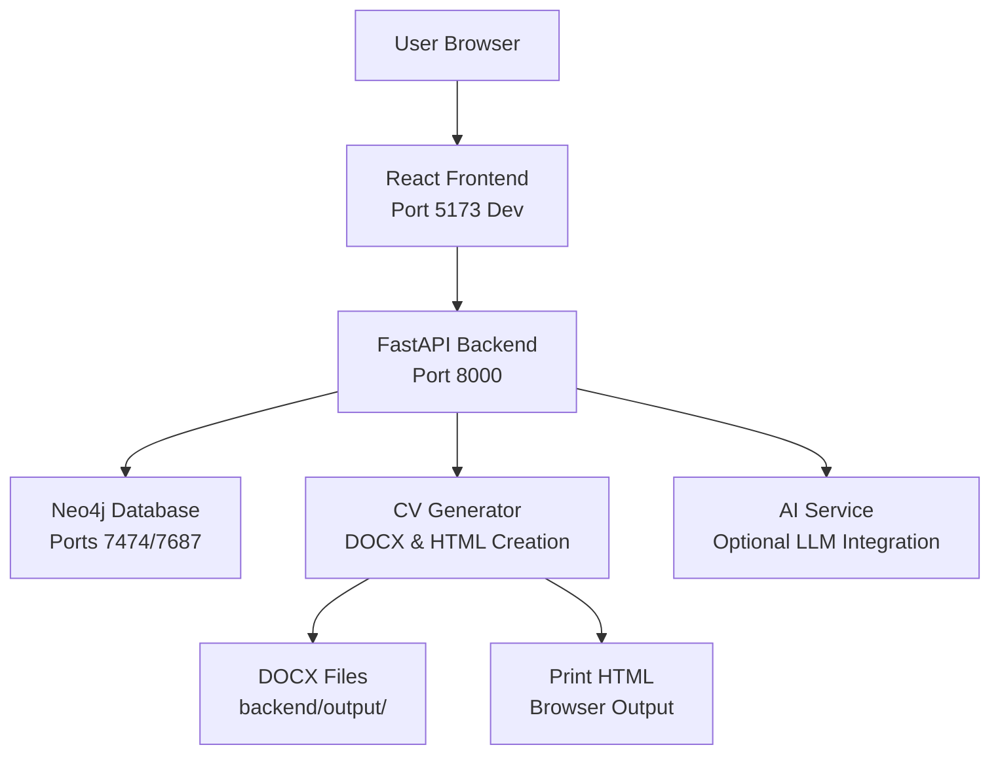

# CV Generator

A full-stack application for generating professional CV documents with AI-powered assistance. Built with React + TypeScript frontend, Python FastAPI backend, and Neo4j graph database for CV storage and management.

## Overview

The CV Generator simplifies the CV creation process by providing:
- An intuitive web interface for entering CV information
- AI-powered CV drafting from job descriptions
- Multiple professional themes and styling options
- Reusable master profile for personal info, experience, and education
- Professional DOCX document generation
- Browser-printable HTML output for preview and printing
- Graph database storage for easy CV management

## Architecture



The application uses a **hybrid development architecture**:
- **Backend & Database**: Run in Docker containers for consistency
- **Frontend**: Runs locally for optimal development experience with hot module replacement (HMR)
- **Production**: All services run in Docker with built frontend served by backend

See [Architecture Documentation](docs/architecture/system-overview.md) for detailed information.

## Features

### Core Features

- **Modern Web Interface**: React 18 UI with Tailwind CSS for creating and managing CVs
- **DOCX Generation**: Generate professional Word-compatible documents using Pandoc
- **Print HTML**: Browser-printable HTML output for preview and printing (A4 format)
- **CV Storage**: Neo4j graph database for storing and managing CV data
- **CRUD Operations**: Create, read, update, and delete CVs via REST API
- **Search & Filter**: Search CVs by name, email, or other criteria with pagination

### AI Features

- **JD-Based CV Drafting**: Generate tailored CV drafts from job descriptions using your saved master profile
- **In-Form AI Assist**: Per-field rewrite and bullet point generation helpers using LLM integration
- **Smart Selection**: Automatically selects and reorders experiences/projects based on job requirements
- **Evidence-Based**: Only uses facts from your profile; asks questions for missing information

See [AI Documentation](docs/ai/overview.md) for details.

### Master Profile

- **Save Once, Reuse Everywhere**: Store personal info, experience, education, and skills in a master profile
- **Profile Management**: Load, update, and delete your master profile
- **CV Generation**: Use profile data as the foundation for all CVs
- **Version Control**: Track profile updates with timestamps

### Multiple Themes

Choose from 10 professional CV themes:

- **accented**: Two-column layout with accent colors
- **classic**: Traditional single-column layout
- **colorful**: Vibrant, bright accent colors
- **creative**: Creative/design style with vibrant colors
- **elegant**: Sophisticated, professional design
- **executive**: Refined, conservative executive style
- **minimal**: Simple, minimal styling
- **modern**: Clean, contemporary design
- **professional**: Professional/corporate style with dark navy colors
- **tech**: Tech industry style with modern, green accents

### Rich Text Editing

- **TipTap Editor**: Rich text editing with formatting options (bold, italic, underline, lists, links)
- **HTML Storage**: Rich text fields store HTML with server-side sanitization
- **Character Counting**: Real-time character count for text fields
- **Line Break Preservation**: Maintains formatting when editing

## Technology Stack

- **Frontend**: React 18, TypeScript, Tailwind CSS, Vite
- **Backend**: Python 3.11, FastAPI, Uvicorn
- **Database**: Neo4j 5.15 (graph database)
- **Document Generation**: Pandoc + python-docx (DOCX), Jinja2 templates (Print HTML)
- **AI Integration**: OpenAI-compatible API support (optional)
- **Containerization**: Docker, Docker Compose

## Prerequisites

- **Docker Engine**: Version 20.10 or higher
- **Docker Compose**: Version 2.0 or higher
- **Node.js**: Version 18 or higher (for frontend development)
- **npm**: Version 9 or higher

Optional:
- **Python**: Version 3.11 or higher (for local backend development without Docker)

Verify installations:
```bash
docker --version
docker-compose --version
node --version
npm --version
```

## Quick Start

### Option 1: Quick Start Script (Recommended)

The easiest way to get started:

```bash
# Start all services (Docker backend + local frontend)
npm run dev:full
# or
./scripts/run-dev.sh
```

This single command will:
- Start Docker services (backend + Neo4j)
- Install frontend dependencies if needed
- Start the frontend dev server with HMR on port 5173

**To stop everything:**
```bash
./scripts/stop-dev.sh
# or press Ctrl+C in the terminal
```

### Option 2: Docker-Only Setup

For production-like setup (slower HMR, but no local Node.js needed):

```bash
# Start all services
docker-compose up -d

# Access the application
# Frontend: http://localhost:8000
# API Docs: http://localhost:8000/docs
```

### Option 3: Manual Hybrid Setup

For the best development experience with hot module replacement:

1. **Start backend and database:**
   ```bash
   docker-compose up -d
   ```

2. **Install frontend dependencies** (one-time):
   ```bash
   npm install
   ```

3. **Start frontend dev server:**
   ```bash
   npm run dev
   ```

4. **Access the application:**
   - Frontend (with HMR): http://localhost:5173
   - API Documentation: http://localhost:8000/docs
   - Neo4j Browser: http://localhost:7474 (username: `neo4j`, password: `cvpassword`)

**Benefits of hybrid setup:**
- Frontend changes reload instantly with Vite HMR
- Backend Python changes auto-reload in Docker
- Better IDE integration and debugging
- Faster development cycle

### Access Points

Once running, access:
- **Frontend**: http://localhost:5173 (dev) or http://localhost:8000 (Docker-only)
- **API Documentation**: http://localhost:8000/docs (Swagger UI)
- **ReDoc**: http://localhost:8000/redoc
- **Neo4j Browser**: http://localhost:7474 (username: `neo4j`, password: `cvpassword`)

### View Logs

```bash
# All services
docker-compose logs -f

# Specific service
docker-compose logs -f app
docker-compose logs -f neo4j
```

### Stop Services

```bash
# Stop services (keep data)
docker-compose down

# Stop and remove volumes (clean database)
docker-compose down -v
```

## API Endpoints

### Health Check

- **GET** `/api/health` - Check API and database connectivity

### CV Management

- **POST** `/api/save-cv` - Save CV data to Neo4j without generating file
- **GET** `/api/cv/{cv_id}` - Retrieve CV data by ID
- **GET** `/api/cvs` - List all CVs (query params: `limit`, `offset`, `search`)
- **PUT** `/api/cv/{cv_id}` - Update existing CV data
- **DELETE** `/api/cv/{cv_id}` - Delete CV from Neo4j

### Document Generation

- **POST** `/api/generate-cv-docx` - Generate DOCX file from CV data and save to Neo4j
- **POST** `/api/cv/{cv_id}/generate-docx` - Generate DOCX for existing CV
- **GET** `/api/download-docx/{filename}` - Download generated DOCX file
- **POST** `/api/generate-cv-html` - Generate HTML file from CV data
- **POST** `/api/cv/{cv_id}/generate-html` - Generate HTML for existing CV
- **GET** `/api/download-html/{filename}` - Download generated HTML file

### Print HTML

- **POST** `/api/render-print-html` - Render browser-printable HTML from CV data
- **GET** `/api/cv/{cv_id}/print-html` - Render browser-printable HTML for existing CV

### Profile Management

- **POST** `/api/profile` - Save or update master profile
- **GET** `/api/profile` - Get master profile
- **GET** `/api/profiles` - List all profiles
- **GET** `/api/profile/{updated_at}` - Get profile by timestamp
- **DELETE** `/api/profile` - Delete master profile
- **DELETE** `/api/profile/{updated_at}` - Delete profile by timestamp

### AI Endpoints

- **POST** `/api/ai/generate-cv` - Generate CV draft from job description and master profile
- **POST** `/api/ai/rewrite` - Rewrite text using LLM with custom prompt

See [API Documentation](docs/backend/api-endpoints.md) for detailed request/response structures.

## Configuration

### Environment Variables

Create a `.env` file in the project root (or use environment variables):

```env
# Neo4j Configuration
NEO4J_URI=bolt://neo4j:7687
NEO4J_USER=neo4j
NEO4J_PASSWORD=cvpassword
NEO4J_DATABASE=neo4j

# CORS Configuration
CORS_ORIGINS=http://localhost:5173,http://localhost:8000

# AI Configuration (Optional)
AI_ENABLED=false
AI_BASE_URL=https://api.openai.com/v1
AI_API_KEY=your-api-key-here
AI_MODEL=gpt-3.5-turbo
AI_TEMPERATURE=0.7
AI_REQUEST_TIMEOUT_S=30
```

**Note**: The `docker-compose.yml` file includes default values for all variables. You only need to set them in `.env` if you want to override defaults.

### AI Configuration

To enable AI features:

1. Set `AI_ENABLED=true` in `.env`
2. Configure your LLM provider:
   - **OpenAI**: `AI_BASE_URL=https://api.openai.com/v1`
   - **OpenRouter**: `AI_BASE_URL=https://openrouter.ai/api/v1`
   - **Groq**: `AI_BASE_URL=https://api.groq.com/openai/v1`
   - **Together**: `AI_BASE_URL=https://api.together.xyz/v1`
   - **Local vLLM**: `AI_BASE_URL=http://localhost:8001/v1`
3. Set `AI_API_KEY` with your provider's API key
4. Restart Docker containers: `docker-compose down && docker-compose up -d`

See [AI Configuration Documentation](docs/ai/configuration.md) for details.

## Development

### NPM Scripts

**Development:**
- `npm run dev` - Start frontend dev server (Vite)
- `npm run dev:full` - Start Docker backend + local frontend (recommended)
- `npm start` - Alias for `dev:full`

**Building:**
- `npm run build` - Build frontend for production (Vite)
- `npm run build:watch` - Build with watch mode
- `npm run preview` - Preview production build

**Type Checking:**
- `npm run type-check` - TypeScript type checking

**Testing:**
- `npm test` - Run all tests (backend + frontend)
- `npm run test:backend` - Run backend tests (pytest in Docker)
- `npm run test:frontend` - Run frontend tests (Vitest locally)
- `npm run test:coverage` - Run tests with coverage reports

**Linting:**
- `npm run lint:backend` - Lint backend code (flake8 in Docker)
- `npm run lint:frontend` - Lint frontend code (ESLint locally)

**Formatting:**
- `npm run format:backend` - Format backend code (black in Docker)
- `npm run format:frontend` - Format frontend code (Prettier locally)

### Running Individual Tests

**Backend:**
```bash
# Single test file
docker-compose exec -T app pytest tests/test_file.py::test_name -v

# With coverage
docker-compose exec -T app pytest --cov=backend --cov-report=html
```

**Frontend:**
```bash
# Single test file
cd frontend && vitest run src/path/to/test.test.ts

# Watch mode
cd frontend && vitest
```

### Development Workflow

1. **Start development environment:**
   ```bash
   npm run dev:full
   ```

2. **Make changes:**
   - Frontend changes auto-reload with Vite HMR
   - Backend changes auto-reload in Docker

3. **Run tests:**
   ```bash
   npm test
   ```

4. **Check types:**
   ```bash
   npm run type-check
   ```

5. **Lint and format:**
   ```bash
   npm run lint:backend && npm run lint:frontend
   npm run format:backend && npm run format:frontend
   ```

See [Development Documentation](docs/development/workflow.md) for best practices and detailed guides.

## Testing

### Test Structure

- **Backend Tests**: `backend/tests/` (pytest)
- **Frontend Tests**: `frontend/src/__tests__/` (Vitest + React Testing Library)

### Running Tests

**All tests:**
```bash
npm test
```

**Backend only:**
```bash
npm run test:backend
```

**Frontend only:**
```bash
npm run test:frontend
```

**With coverage:**
```bash
npm run test:coverage
```

### Coverage Requirements

- **Backend**: Minimum 70% coverage required
- **Frontend**: Coverage reports generated in `frontend/coverage/`

See [Testing Documentation](docs/development/testing.md) for detailed testing strategies and examples.

## Building for Production

### Build Frontend

```bash
npm run build
```

This creates optimized production files in `frontend/dist/`.

### Build and Run with Docker

```bash
# Build and start all services
docker-compose up -d --build

# Access at http://localhost:8000
```

The backend automatically serves the built frontend from `/app/frontend/dist` when available.

See [Production Deployment Documentation](docs/deployment/production.md) for detailed deployment guides.

## Project Structure

```
cv/
├── backend/                    # Python FastAPI backend
│   ├── app.py                 # Main FastAPI application
│   ├── app_helpers/           # Application helpers
│   │   ├── routes/            # API route handlers
│   │   ├── exception_handlers/ # Error handling
│   │   ├── lifespan.py       # Application lifecycle
│   │   └── middleware.py     # CORS, rate limiting
│   ├── cv_generator/          # CV generation (DOCX, HTML, print HTML)
│   │   ├── generator.py      # Main generator
│   │   ├── markdown_renderer/ # Markdown rendering
│   │   ├── html_renderer/    # HTML rendering
│   │   ├── print_html_renderer.py # Print HTML generation
│   │   └── templates/        # DOCX and HTML templates
│   ├── database/             # Neo4j database operations
│   │   ├── connection.py     # Database connection
│   │   ├── models.py         # Database models
│   │   └── queries/         # Database query functions
│   ├── models/               # Pydantic models
│   ├── services/             # Business logic services
│   │   ├── ai/               # AI service integration
│   │   └── cv_file_service.py # File management
│   ├── themes/               # CV theme definitions
│   ├── tests/                # Backend tests
│   └── output/               # Generated CV files
├── frontend/                  # React TypeScript frontend
│   ├── src/
│   │   ├── components/       # React components
│   │   ├── app_helpers/      # Frontend helpers
│   │   │   ├── cvForm/      # CV form logic
│   │   │   └── richTextarea/ # Rich text editor
│   │   ├── services/         # API services
│   │   ├── types/            # TypeScript types
│   │   └── App.tsx           # Main app component
│   └── __tests__/            # Frontend tests
├── docs/                      # Comprehensive documentation
│   ├── getting-started/      # Setup guides
│   ├── architecture/         # System architecture
│   ├── backend/              # Backend documentation
│   ├── frontend/             # Frontend documentation
│   ├── development/          # Development guides
│   ├── deployment/           # Deployment guides
│   └── ai/                   # AI feature documentation
├── docker-compose.yml        # Docker Compose configuration
├── Dockerfile                # Backend Dockerfile
├── package.json              # NPM scripts and dependencies
└── requirements.txt          # Python dependencies
```

See [Architecture Documentation](docs/architecture/system-overview.md) for detailed component descriptions.

## Documentation

Comprehensive documentation is available in the `./docs` directory:

- **[Documentation Index](docs/README.md)** - Complete documentation overview
- **[Getting Started](docs/getting-started/)** - Setup and quick start guides
- **[Architecture](docs/architecture/)** - System design and data flow
- **[Backend API](docs/backend/api-endpoints.md)** - Complete API reference
- **[AI Features](docs/ai/)** - AI-powered CV generation guides
- **[Development](docs/development/)** - Development workflow and testing
- **[Deployment](docs/deployment/)** - Production deployment guides
- **[Troubleshooting](docs/troubleshooting/)** - Common issues and solutions

## Code Style

### General Principles

- **Modularization**: All code must be modularized into logical, reusable modules
- **File Length**: Files must not exceed 150 lines of code
- **Class Organization**: One class per file
- **DRY Principle**: Don't Repeat Yourself - avoid code duplication

### TypeScript

- Strict types, no `any`
- Unused variables prefixed with `_`
- No `console.log` in production code

### Python

- flake8 linting + black formatting
- pytest for tests (70% coverage minimum)
- Modular, reusable components

See [AGENTS.md](AGENTS.md) for complete development guidelines.

## Troubleshooting

### Common Issues

**Port already in use:**
```bash
# Check what's using the port
lsof -i :8000
lsof -i :5173

# Stop conflicting services or change ports in docker-compose.yml
```

**Docker containers won't start:**
```bash
# Check Docker status
docker ps -a

# View logs
docker-compose logs

# Rebuild containers
docker-compose up -d --build
```

**Frontend dependencies issues:**
```bash
# Clear node_modules and reinstall
rm -rf node_modules frontend/node_modules
npm install
```

**Database connection errors:**
- Verify Neo4j is running: `docker-compose ps`
- Check Neo4j logs: `docker-compose logs neo4j`
- Verify credentials in `.env` match `docker-compose.yml`

See [Troubleshooting Documentation](docs/troubleshooting/) for more solutions.

## Contributing

When contributing to this project:

1. Follow the code style guidelines (see [AGENTS.md](AGENTS.md))
2. Write tests for new features (70% coverage minimum)
3. Update documentation in `./docs` for new features
4. Keep files under 150 lines
5. Run linting and formatting before committing
6. Ensure all tests pass: `npm test`

## License

MIT
