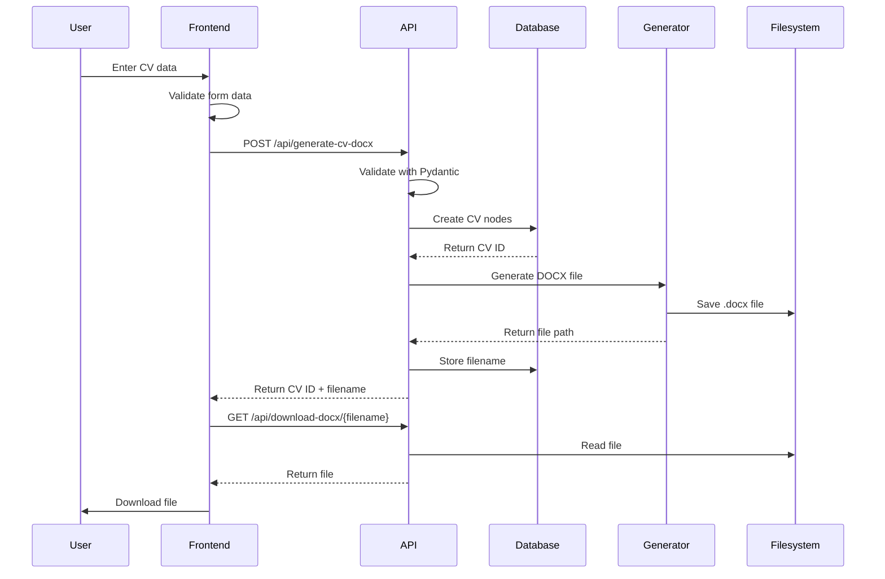
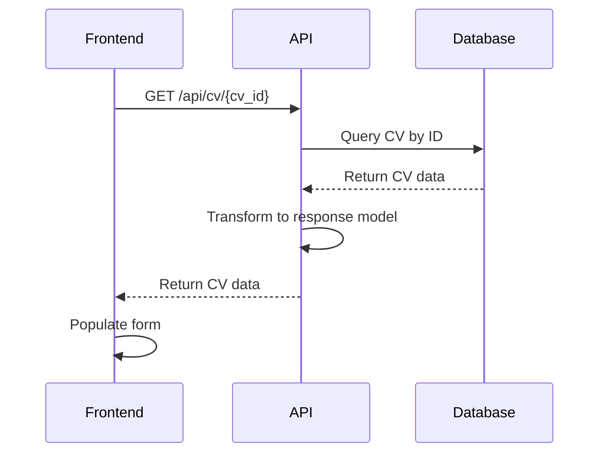
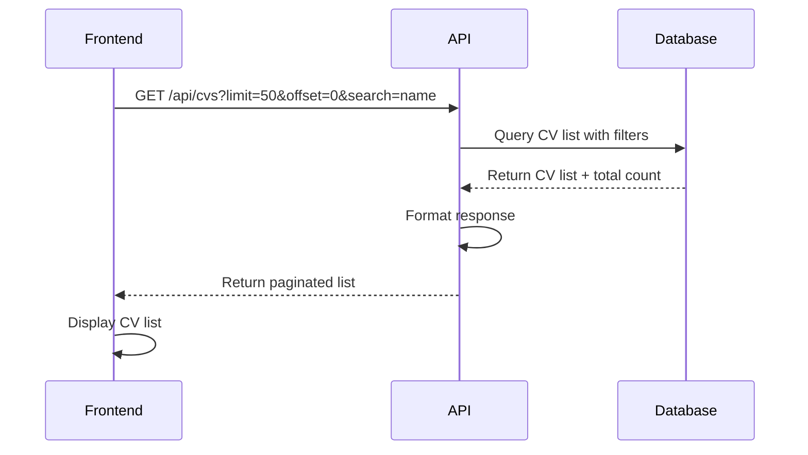
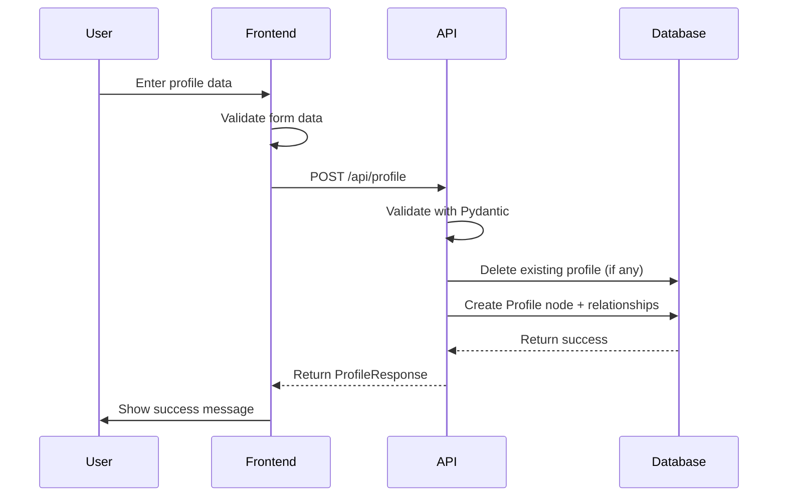
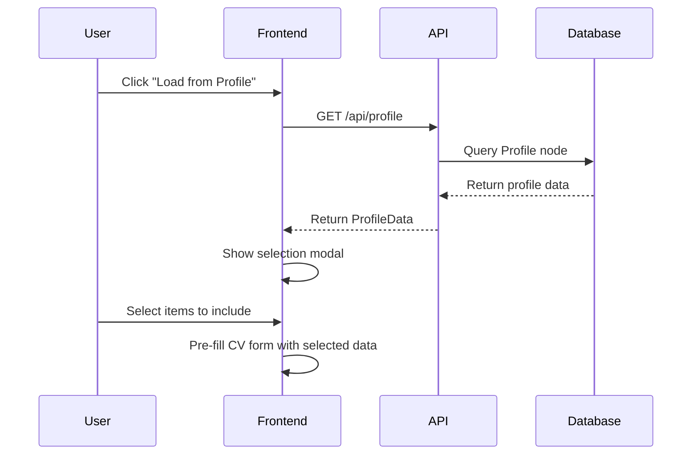
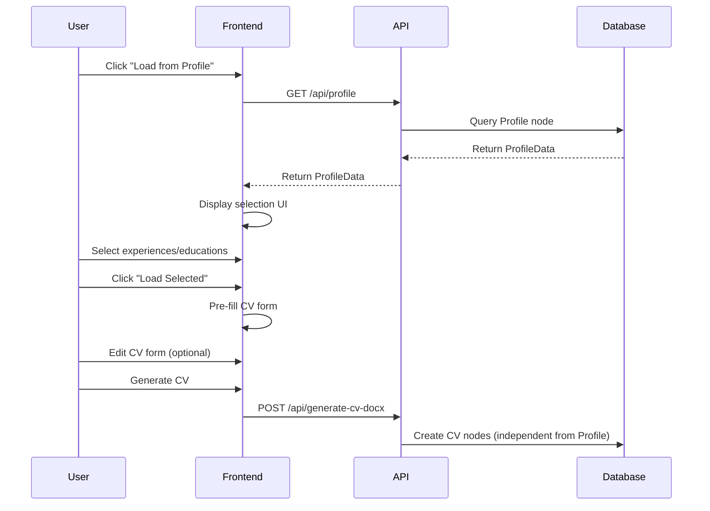
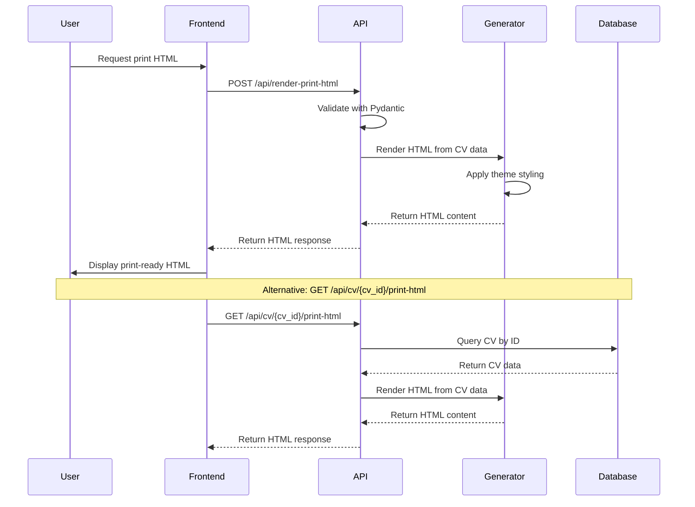

# Data Flow

This document describes how data flows through the CV Generator application for key operations.

## CV Generation Flow

## CV Retrieval Flow

## CV List Flow

## CV Update Flow

Frontend sends PUT request → API validates → Database deletes old relationships → Creates new nodes → Returns success.

## CV Delete Flow

Frontend sends DELETE request → API deletes CV and relationships from database → Returns success.

## Profile Save Flow

## Profile Load Flow

## Profile to CV Transfer Flow

## Print HTML Generation Flow

## Error Handling

All endpoints: validation errors (400), not found (404), server errors (500). Frontend displays error messages.

See [API Endpoints](../backend/api-endpoints.md) for details.
