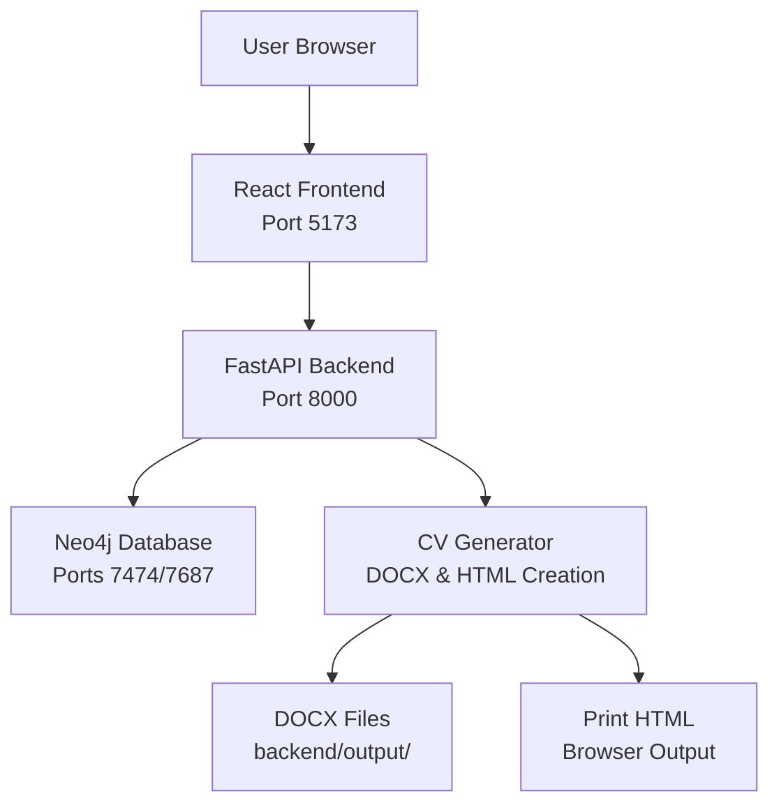

# System Overview

The CV Generator follows a three-tier architecture with clear separation between presentation, business logic, and data layers.

## Architecture Diagram

## Components

### Frontend Layer

- **Technology**: React 18 with TypeScript
- **Build Tool**: Vite
- **Styling**: Tailwind CSS
- **State Management**: React Hook Form
- **Location**: Runs locally on host machine (development)

**Responsibilities**:
- User interface for CV data entry
- Form validation and state management
- API communication
- File download handling

### Backend Layer

- **Technology**: Python 3.11 with FastAPI
- **Server**: Uvicorn ASGI server
- **Location**: Runs in Docker container

**Responsibilities**:
- RESTful API endpoints
- Request validation using Pydantic models
- Business logic orchestration
- Database operations
- DOCX document generation
- Print HTML generation

### Data Layer

- **Technology**: Neo4j 5.15 graph database
- **Location**: Runs in Docker container

**Responsibilities**:
- CV data storage as graph nodes
- Relationship management between CV entities
- Query execution for CRUD operations

## Data Flow

1. User enters CV data in React form
2. Frontend validates and sends POST request to `/api/generate-cv-docx`
3. Backend validates data with Pydantic models
4. Backend saves data to Neo4j database
5. Backend generates DOCX file using the DOCX generator
6. Backend returns CV ID and filename
7. Frontend downloads generated file

See [Data Flow Documentation](data-flow.md) for detailed request/response flows.

## Execution Environments

The application uses a hybrid development setup. See [Execution Environments](execution-environments.md) for details on where each component runs.
