# Profile Update Flow

## Overview

The profile update process follows a **delete-then-create** pattern within a single Neo4j transaction. This ensures atomicity and avoids cartesian products by deleting nodes separately in dependency order.

## Process Flow

```mermaid
flowchart TD
    Start([update_profile called]) --> BuildParams[Build save parameters<br/>with new updated_at timestamp]
    BuildParams --> StartTx[Start Neo4j Write Transaction]

    StartTx --> UpdateTimestamp[Update Profile Timestamp<br/>SET profile.updated_at = new_timestamp]

    UpdateTimestamp --> DeletePhase[Delete Phase<br/>Remove old nodes in dependency order]

    DeletePhase --> DeleteProjects[Delete Projects<br/>Leaf nodes, no dependencies]
    DeleteProjects --> DeleteExperiences[Delete Experiences<br/>After Projects deleted]
    DeleteExperiences --> DeleteEducation[Delete Education Nodes]
    DeleteEducation --> DeleteSkills[Delete Skill Nodes]
    DeleteSkills --> DeletePerson[Delete Person Node<br/>Last - references other nodes]

    DeletePerson --> VerifyDeletion[Verify Deletion<br/>Check all Person nodes deleted]
    VerifyDeletion --> CreatePhase[Create Phase<br/>Build new nodes with updated data]

    CreatePhase --> CreatePerson[Create Person Node<br/>Link to Profile<br/>Return elementId]
    CreatePerson --> VerifyPerson[Verify Single Person<br/>Check exactly one Person exists]
    VerifyPerson --> CreateExperiences[Create Experience Nodes<br/>Bound to new Person via elementId<br/>with Projects nested]
    CreateExperiences --> CreateEducation[Create Education Nodes<br/>Bound to new Person via elementId]
    CreateEducation --> CreateSkills[Create Skill Nodes<br/>Bound to new Person via elementId]

    CreateSkills --> Verify[Verify Profile Updated<br/>Check profile exists with new timestamp]
    Verify --> CommitTx[Commit Transaction]
    CommitTx --> End([Return Success])

    style UpdateTimestamp fill:#e1f5ff
    style DeletePhase fill:#ffe1e1
    style CreatePhase fill:#e1ffe1
    style Verify fill:#fff4e1
```



## Detailed Steps

### 1. Preparation
- Generate new `updated_at` timestamp
- Build parameters from `profile_data` using `build_save_params()`
- Start Neo4j write transaction

### 2. Update Profile Timestamp
```cypher
MATCH (profile:Profile)
ORDER BY profile.updated_at DESC
LIMIT 1
SET profile.updated_at = $updated_at
```
- Finds the most recent Profile node
- Updates its timestamp to the new value
- **Profile node is never deleted** - only its timestamp changes

### 3. Delete Old Nodes (Dependency Order)

Nodes are deleted separately to avoid cartesian products:

**Step 3.1: Delete Projects**
- Leaf nodes with no dependencies
- Query: `MATCH (profile)<-[:BELONGS_TO_PROFILE]-(proj:Project) DETACH DELETE proj`

**Step 3.2: Delete Experiences**
- After Projects are deleted (Experiences reference Projects)
- Query: `MATCH (profile)<-[:BELONGS_TO_PROFILE]-(exp:Experience) DETACH DELETE exp`

**Step 3.3: Delete Education**
- Independent nodes
- Query: `MATCH (profile)<-[:BELONGS_TO_PROFILE]-(edu:Education) DETACH DELETE edu`

**Step 3.4: Delete Skills**
- Independent nodes
- Query: `MATCH (profile)<-[:BELONGS_TO_PROFILE]-(skill:Skill) DETACH DELETE skill`

**Step 3.5: Delete Person**
- Deleted last because it references Experiences, Education, and Skills
- Query: `MATCH (person:Person)-[:BELONGS_TO_PROFILE]->(profile) DETACH DELETE person`

**Step 3.6: Verify Deletion**
- Verifies all Person nodes were deleted
- Query: `MATCH (profile:Profile { updated_at: $updated_at }) OPTIONAL MATCH (person:Person)-[:BELONGS_TO_PROFILE]->(profile) RETURN count(person) AS remaining_persons`
- **Hard-fails** (raises exception) if any Person nodes remain
- Prevents node multiplication if deletion fails

### 4. Create New Nodes

**Step 4.1: Create Person Node**
- Creates new Person node with updated data
- Links to Profile via `BELONGS_TO_PROFILE` relationship
- Returns `elementId(newPerson)` for binding child nodes
- **Note**: `elementId()` is used only within the same transaction; not stored or exposed externally

**Step 4.2: Verify Single Person**
- Verifies exactly one Person node exists after creation
- Query: `MATCH (profile:Profile { updated_at: $updated_at }) MATCH (person:Person)-[:BELONGS_TO_PROFILE]->(profile) RETURN count(person) AS person_count`
- Raises exception if count != 1 (safety check)

**Step 4.3: Create Experience Nodes**
- Creates Experience nodes bound to the newly created Person via `elementId`
- Query: `MATCH (person:Person) WHERE elementId(person) = $person_element_id`
- For each Experience, creates nested Project nodes
- Links: `Person -[:HAS_EXPERIENCE]-> Experience -[:HAS_PROJECT]-> Project`
- All link to Profile via `BELONGS_TO_PROFILE`
- **Key**: Binds to specific Person, not any Person linked to Profile (prevents multiplication)

**Step 4.4: Create Education Nodes**
- Creates Education nodes bound to the newly created Person via `elementId`
- Query: `MATCH (person:Person) WHERE elementId(person) = $person_element_id`
- Links: `Person -[:HAS_EDUCATION]-> Education -[:BELONGS_TO_PROFILE]-> Profile`

**Step 4.5: Create Skill Nodes**
- Creates Skill nodes bound to the newly created Person via `elementId`
- Query: `MATCH (person:Person) WHERE elementId(person) = $person_element_id`
- Links: `Person -[:HAS_SKILL]-> Skill -[:BELONGS_TO_PROFILE]-> Profile`

### 5. Verification
- Verifies Profile node exists with new timestamp
- Returns `True` if successful, `False` otherwise

## Key Design Decisions

### Why Delete Then Create?

1. **Avoids Cartesian Products**: Deleting nodes separately prevents Neo4j from loading all combinations into memory
2. **Dependency Order**: Deletes in reverse dependency order (leaf nodes first) to avoid constraint violations
3. **Atomicity**: All operations happen in a single transaction - either all succeed or all fail

### Why Keep Profile Node?

The Profile node itself is never deleted, only its `updated_at` timestamp is updated. This ensures:
- Profile identity persists across updates
- No orphaned Profile nodes
- Simpler query logic (always one Profile node)

### Transaction Safety

All operations occur within `session.execute_write(work)`, ensuring:
- **ACID compliance**: All-or-nothing execution
- **Isolation**: Other transactions see consistent state
- **Rollback**: If any step fails, entire transaction rolls back

## Memory Optimization

The refactored code avoids the cartesian product bug by:
- Deleting each node type separately
- Using `collect(DISTINCT ...)` to avoid duplicates
- Processing deletions sequentially, not in parallel

This reduces memory usage from ~1.6GB to ~100MB for typical profile updates.

## Duplicate Node Prevention

The update process prevents node multiplication by:

1. **Hard-failing verification**: If deletion doesn't remove all Person nodes, the transaction aborts with an exception
2. **Binding to specific Person**: Child nodes (Experiences, Education, Skills) are created bound to the newly created Person via `elementId()`, not by matching any Person linked to Profile
3. **Verification after creation**: Ensures exactly one Person node exists after creation

This prevents the exponential multiplication bug where N Person nodes × M experiences = N×M Experience nodes.

## Related Files

- `backend/database/queries/profile_update/update.py` - Main orchestration
- `backend/database/queries/profile_update/delete.py` - Deletion operations and verification
- `backend/database/queries/profile_update/person.py` - Person node creation (returns elementId)
- `backend/database/queries/profile_update/experience.py` - Experience node creation (bound to Person via elementId)
- `backend/database/queries/profile_update/education.py` - Education node creation (bound to Person via elementId)
- `backend/database/queries/profile_update/skill.py` - Skill node creation (bound to Person via elementId)
- `backend/database/queries/profile_helpers.py` - Parameter building
